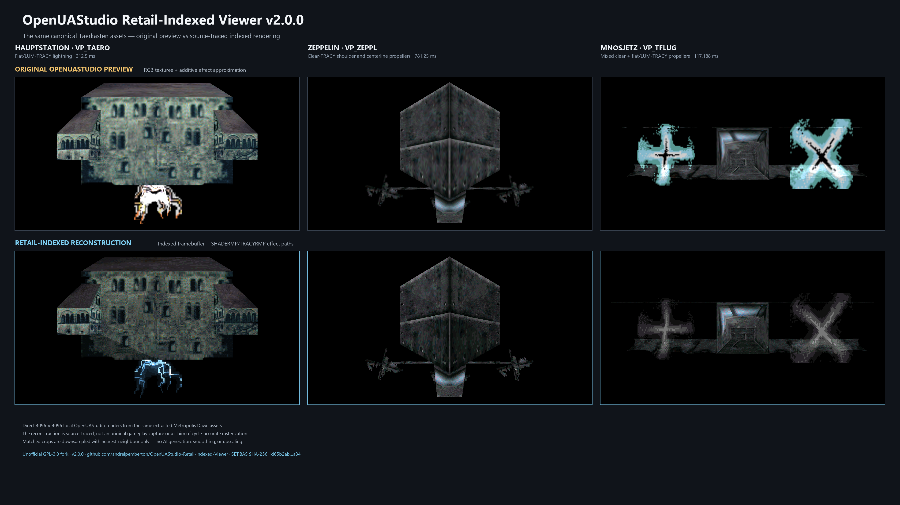

# OpenUAStudio

OpenUAStudio is an independent, community-developed editing workbench for OpenUA and Microsoft Urban Assault (1998).

The project brings together tools and workflows for inspecting, editing, converting, and creating compatible game data.

Its structure, interface, supported formats, features, and integrated editors may change as development continues.

## Project status

OpenUAStudio is under active development.

Features, file layouts, commands, dependencies, workflows, and user-interface elements may be added, removed, renamed, or reorganized without notice.

The current repository should be treated as a development version rather than a final product specification.

The latest tagged release of this fork is [OpenUAStudio Retail Indexed Viewer
v4.0.0](https://github.com/andreipemberton/OpenUAStudio-Retail-Indexed-Viewer/releases/tag/v4.0.0).

## Basic use

Run from source:

```bash
python main.py
```

On normal startup, OpenUAStudio first shows a tool selector for the Model
Editor, Snapshot Studio, Map Editor, Collision Editor, or Wireframe Editor.

The current fork release distributes the application as source code rather
than as a prebuilt executable. Build or run it from source; the stale executable
inherited in upstream Git history is not present in the current tree or GitHub
source archives. Version 4 also includes derived visual-reference media, as
described in the third-party notice below, but no raw game assets.

### Viewer-only launch

The viewer-focused entry point opens the read-only Snapshot Studio directly,
without the multi-tool selector:

```bash
python -m pip install -r requirements-viewer.txt
python viewer_main.py [path/to/asset.base-or-SET.BAS]
```

The broader editable upstream workbench is intentionally retained. Snapshot
Studio shares parsers and presentation code with the main suite, while the
merge commit preserves the upstream GPL history and provenance. Incompatible
renderer-policy tests and a stale prebuilt executable were resolved out of the
v3 tip rather than presented as current fork output.

Version 3.0.0 merges upstream `main` through commit `74bea393`, including its
expanded Collision Editor, Fire Point, Gun Point, and opt-in Cockpit View
workspaces. Both Git parent histories are retained. Where the two development
lines differed, this fork keeps the explicit **OpenUA preview** / **Retail
indexed (reconstructed)** choice, the diagnostic TRACY controls, and the
fail-closed export provenance described below. The v3.0.0 fork release is
source-only and does not attach a separately rebuilt Windows executable.

Keeping the OpenUA preview selectable also keeps the existing depth renderer
and its `projective_texture_coefficients()` helper alongside the indexed path;
their retention is deliberate, not an incomplete upstream merge. The
`OpenUAStudio.spec` file declares NumPy as a hidden import for anyone building
the application, but this source release does not claim or attach a newly
validated compiled package.

Version 3.1.0 is a maintenance release over that reconciliation. It fixes the
VANM UV saved-state bookkeeping after a verified family export, restores
selection-preserving SET.BAS context-menu previews, and updates the associated
UI/export contracts without weakening unresolved-dependency protection. Its
canonical-enabled headless suite runs 497 tests with 496 passes, no failures or
errors, and one skipped optional `UA_RC1` corpus test.

Version 4.0.0 adds a narrowly scoped `source_atts_only` indexed-capture policy
for source-forensic cases where the original mapping-driven renderer did not
submit an unmapped skeleton polygon. The default remains fail-closed. The
policy is exercised against `VP_BRGRO`, where the shipped AMESH ATTS and AREA
ADE tables account for every polygon except `root/36`; no replacement material
or geometry is invented.

The release also publishes a bounded set of [51 retail-indexed animated unit
turntables](docs/retail-indexed-turntables-v4/README.md) and an
[all-unit visual index](docs/retail-indexed-turntables-v4/index.png). These are
direct 1024 x 1024 renderer captures with deterministic cycle-fit animation,
not image-generated or upscaled artwork and not native-speed gameplay footage.
The repository includes the final GIFs and contact index, but excludes all
3,060 PNG master frames and all proprietary game archives and source assets.

### Reconstructed retail-indexed renderer

The normal **Textured - OpenUA preview** renderer remains the default. A
second explicit choice, **Textured - Retail indexed (reconstructed)**, is
available in the model-view mode control and in Snapshot Studio's **Renderer**
control. Snapshot exports and complete-model batch exports honor the selected
renderer. Batch manifests record the requested and effective renderer for each
image, fallback reasons, source-table hashes, and exact index-buffer hashes.
`run_info.json` summarizes those per-image records without treating an old
file retained by **Skip existing** as a newly verified indexed render.
If the chosen batch folder already contains PNGs, **Skip existing** now
requires its `run_info.json` to prove the same renderer and flat-TRACY
destination and distance-fade profile; a different or unverifiable profile is
refused before asset scanning. Older indexed manifests with no distance-fade
field are interpreted as the historical default, **off**.

Snapshot Studio also exposes a **Flat/LUM-TRACY** destination selector. Its
default **Live framebuffer - retail** setting preserves the source-traced frame
clear at palette index zero and reads the actual destination beneath every
effect texel. **Force palette row - diagnostic** lets an investigator inspect
any one of the 256 `TRACYRMP` destination rows, but is deliberately labeled and
recorded as noncanonical. The numeric index is authoritative; its swatch comes
from the resolved indexed display palette and is never inferred from RGB.
Live-mode manifests record no forced-row operand, even if the disabled row
control retains a value for later diagnostic use.

An opt-in **Retail AREA distance fade (1400/600)** checkbox reconstructs the
normal gameplay fade on mapped, gradient-shaded faces authored with
`AREA_FLAG_DPTHFADE`. It is off by default so existing v2 close-up captures do
not change. The gameplay profile begins at 800 Urban Assault model units and
reaches palette index zero at the 1400-unit visibility limit. The asset stores
only the eligibility flag; the runtime supplies the visibility and fade-length
profile. The original BSA class-initialization default is 4096/600 (start
3496), while mission briefing and other runtime contexts can choose different
values. In the asset viewer, the profile is evaluated at the current auto-fit
viewer-camera distance; it is not a recovered mission/world placement. Manual
Snapshot suggestions add `_DFADE` while the option is active; complete-model
batch filenames remain unchanged and the requested/effective fade state is
recorded in their manifests instead.

“Effective” in that provenance means the selected profile reached eligible
render paths, not that a second fade-disabled frame was rendered and found to
differ pixel-for-pixel.

The viewer toolbar's **Enable animations** checkbox explicitly starts and
stops resolved VANM/effect playback. Pausing preserves the current interactive
frame, and the existing step/reset controls remain available. Manual Snapshot
exports use the displayed frame. Complete-model batch export deliberately
ignores live playback: it captures the renderer options once, pauses its hidden
viewport, and resets every source to the initial frame for reproducible output.

The reconstructed mode keeps source texture and framebuffer pixels as palette
indices until final display. Ordinary mapped samples use the source-derived
constant-brightness row in the local game's `SHADERMP`; clear-TRACY skips raw
source index zero; and flat/LUM-TRACY bypasses
shade and composites raw texels as
`TRACYRMP[current_background][raw_source]`. Transparent source faces are
replayed through a source-derived publish-depth/LIFO pass instead of being
interleaved as ordinary BSP fragments. Nearest-neighbor indexed sampling is
retained for effect cards. When the optional distance fade is enabled, eligible
AREA faces add the source-traced radial per-vertex distance term before the
brightness value is interpolated across the polygon. This fixes important
cases that ordinary RGB filtering and additive blending cannot represent,
including Taerkasten
Hauptstation lightning and the distinct clear-TRACY and flat-TRACY propeller
systems.

#### Release comparison

The comparison below uses identical cameras and animation states for the
Taerkasten Hauptstation (`VP_TAERO`), Zeppelin (`VP_ZEPPL`), and Mnosjetz
(`VP_TFLUG`). The top row is OpenUAStudio's normal RGB preview; the bottom row
is the source-traced retail-indexed reconstruction from the
[v2.0.0 release](https://github.com/andreipemberton/OpenUAStudio-Retail-Indexed-Viewer/releases/tag/v2.0.0).
It is a viewer-renderer comparison, not an original retail gameplay capture.

[](docs/images/openuastudio-retail-indexed-v2-comparison.png)

The sheet was composed from six fresh native 4096 x 4096 captures and reduced
with nearest-neighbor sampling only. It uses no generative AI, inpainting,
smoothing, color grading, or upscaling.

See [RETAIL_INDEXED_RENDERER.md](RETAIL_INDEXED_RENDERER.md) for the pipeline,
fail-closed export rules, current limits, and reproducible test commands.
The Retail Indexed Viewer release line begins at **v2.0.0**; the current
release is **v4.0.0**. Ongoing user-visible changes are
maintained in [CHANGELOG.md](CHANGELOG.md).

The mode requires a lawfully obtained local game data set containing a
256-entry palette plus matching `REMAP/SHADERMP.ILB` (or `.ILBM`) and
`REMAP/TRACYRMP.ILB` (or `.ILBM`) files. OpenUAStudio reads those files but
does not modify or distribute them. NumPy is strongly recommended for this
mode; the deterministic pure-Python fallback is intended for compatibility,
not high-resolution interactive use.

This is a source-derived reconstruction of the retail indexed-color pipeline,
not a claim of cycle-accurate emulation. It is deliberately labeled
"reconstructed" in the interface. Unknown or unsupported indexed material
combinations fail visibly. The interactive viewport may show the existing
OpenUA preview as an explicitly reported fallback, but manual and batch
exports fail closed instead of silently saving that fallback as an indexed
result.

Exact mode also refuses an ambiguous palette/SET origin when candidate SETs
carry different remap-table hashes. Duplicate candidates are accepted only
when their complete palette, SHADERMP, and TRACYRMP profiles are byte-identical.
The current profile gates cover the main inspected Urban Assault SET tables;
an unrelated remap family that does not satisfy those structural invariants is
reported as unsupported rather than guessed.

### Upstream collaboration

This is an unofficial GPL-3.0-licensed fork. The original OpenUAStudio creator
and current upstream maintainers are welcome to reuse, adapt, cherry-pick, or
merge this fork's changes under the repository license. They may also request
an upstream pull request from this fork for their review. Upstream retains full
control over whether and how any contribution is accepted; this invitation
does not imply endorsement.

For memory safety, NumPy-accelerated indexed exports are limited to 16,777,216
pixels (a square 4096 x 4096 frame). The portable Python backend is limited to
1,048,576 pixels. The normal OpenUA preview retains its existing output-size
range. Canonical indexed rendering always begins with the retail palette-index
zero clear. A custom RGB background is intentionally a presentation
post-composite and never becomes a numeric TRACY table operand. Forced-row
diagnostic exports retain the retail initial clear but substitute the selected
row for each flat/LUM-TRACY lookup; manifests distinguish them from canonical
live-framebuffer renders.

## License

Copyright (C) 2025-2026 TeuZzZ-17

The original OpenUAStudio source code and original project components are licensed under the GNU General Public License version 3 only (`GPL-3.0-only`).

See the `LICENSE` file for the complete license terms.

The GNU GPL applies only to material for which the OpenUAStudio copyright holders have the legal authority to grant that license.

It does not relicense third-party software, game data, trademarks, artwork, textures, models, sounds, documentation, or other materials owned by their respective rights holders.

## Third-party game data and asset notice

OpenUAStudio is an unofficial, fan-made project.

It is not affiliated with, endorsed by, sponsored by, or approved by Microsoft, Xbox Game Studios, TerraTools, or any other original publisher, developer, or rights holder connected with Urban Assault.

Microsoft Urban Assault, its name, trademarks, logos, artwork, game data, audiovisual material, and other proprietary content remain the property of their respective owners.

### Sector preview images

The Map Editor includes visual preview images representing Urban Assault terrain sectors.

These previews are not retail game data files distributed in their original form, nor are they original textures, models, SET.BAS archives, or other source assets extracted directly from the game.

They were rendered from the sector graphics using a visualization utility and were subsequently cropped, processed, upscaled, organized, and adapted for use as functional map-editing references.

The visualization utility used to generate the original previews is not included or distributed with OpenUAStudio.

The previews are included solely to identify terrain sectors and display the editable map grid.

They are not intended to replace the original game, reproduce its underlying data, or provide access to its source assets.

The underlying Urban Assault designs and visual content remain the property of their respective rights holders.

Only the original processing, organization, tool integration, source code, and other independently created OpenUAStudio components are claimed by the project author.

The presence of these preview images in this repository:

- does not transfer ownership;
- does not grant additional rights to copy, sell, sublicense, or redistribute them;
- does not imply endorsement by the original rights holders;
- does not convert proprietary game content into free or open-source material;
- does not place third-party visual content under the GNU GPL.

Users are responsible for obtaining and using game data lawfully and for complying with applicable copyright, trademark, and other laws in their jurisdiction.

This notice is intended to clarify ownership and project scope.

It is not legal authorization to redistribute third-party material and does not replace permission from the relevant rights holders.

A rights holder who believes that material has been included improperly may contact the repository owner through the GitHub repository so the material can be reviewed.

### Retail-indexed unit turntable captures

Version 4 includes [51 animated unit turntables and one contact
index](docs/retail-indexed-turntables-v4/README.md) rendered from a lawfully
obtained local Urban Assault installation. They are technical documentation
captures from the reconstructed renderer, not raw or extractable game archives,
palettes, remap tables, meshes, textures, animations, or executables. The 3,060
lossless PNG master frames and the local game inputs are not distributed.

The captures are not image-generated or upscaled, but the depicted Urban
Assault models, textures, names, and designs remain third-party visual content.
They are not OpenUAStudio source code and are not relicensed under the GPL. The
media catalog contains the more specific capture, provenance, and rights notice.

## Safety and data handling

Treat original game files as read-only whenever possible.

Save edited assets and levels to explicit output paths and keep backups of source data.

OpenUAStudio is intended to support safe editing workflows, but users remain responsible for protecting their own files and installations.

## Warranty

OpenUAStudio is provided without warranty.

Use it at your own risk.

The full warranty disclaimer and limitation of liability are contained in the GNU GPL v3 license text.
