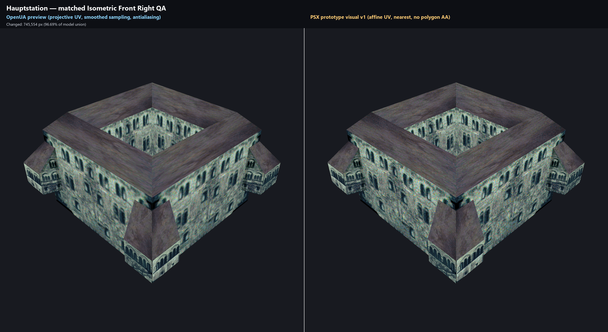

# PSX prototype visualization v1 - matched comparison

This package documents the experimental PSX prototype visualization profile
introduced in OpenUAStudio Retail Indexed Viewer v5.0.0.

The left column is OpenUAStudio's normal OpenUA preview. The right column uses
the fixed `psx_prototype_visual_v1` contract:

- affine texture-coordinate interpolation;
- nearest-neighbor texture sampling;
- polygon antialiasing disabled.

The selected geometry, textures, material mappings, and VANM animation remain
the loaded PC/OpenUA asset family. This profile does not decode PlayStation
`UNIT.BIN`, PW3, PSW, PSV, `.GFX`, `mhwanh`, or `DAT`/`IND` assets, and the
comparison is not a PSX gameplay capture or a claim of cycle-accurate
emulation.

## Capture contract

The comparison was rendered directly at 1536 x 1536 per side with the same
settings on both sides:

- view: Isometric Front Right;
- yaw: -45 degrees;
- pitch: 35.264 degrees;
- zoom: 92 percent;
- presentation background: `#181A20`;
- Hauptstation (`VP_TAERO`) animation time: 312.5 ms.

The camera and resolved animation state match exactly. Alpha coverage also
matches exactly. No renderer fallback was used. The two full-resolution panels
were placed side by side without resizing. The 3072 x 1678 annotated sheet was
composed without AI generation, upscaling, smoothing, color grading, or
source-image interpolation.

The fixed policy produces the expected strong pixel-level difference from the
smoothed projective OpenUA preview:

| Asset | Changed RGB pixels | Changed model-union pixels | OpenUA unique RGB | PSX-v1 unique RGB |
|---|---:|---:|---:|---:|
| Hauptstation | 745,554 | 96.687196% | 159,485 | 160 |

These percentages measure different raster policies; they are not a quality
score or evidence that the v1 preset reproduces every PSX hardware behavior.

## Provenance and artifact boundary

The renderer implementation used for this comparison is commit
`eec4f1a4fb6832b0c9612632b052c6d6e06e30b1`, tree
`7046abc6ab021f49a47a950cbbd333a32ebba295`. The source file
`assembly_viewer.py` had SHA-256
`89c8900e439a1bb9edf67b05ef190da14500f8bb0c6192a7c76a0d390dbd55ee`.
The checkout was clean before and after rendering.

[`manifest.json`](manifest.json) records the repository-relative public
provenance and detailed measurements. [`SHA256SUMS.txt`](SHA256SUMS.txt)
covers every published file in this package except itself.

Only the derived comparison image and its documentation are committed here.
The internal raw panels, difference heatmaps, multi-asset QA sheet, and local
path-bearing QA manifest remain outside Git. No `.BAS`, `.SKLT`, `.ILBM`,
`.ANM`, palette, remap table, PSX disc image, prototype executable, or other raw
game asset is included. Rights in the underlying Urban Assault visual content
remain with their respective owners; this unofficial comparison is
documentation for the viewer fork and is not relicensed as GPL source code.
