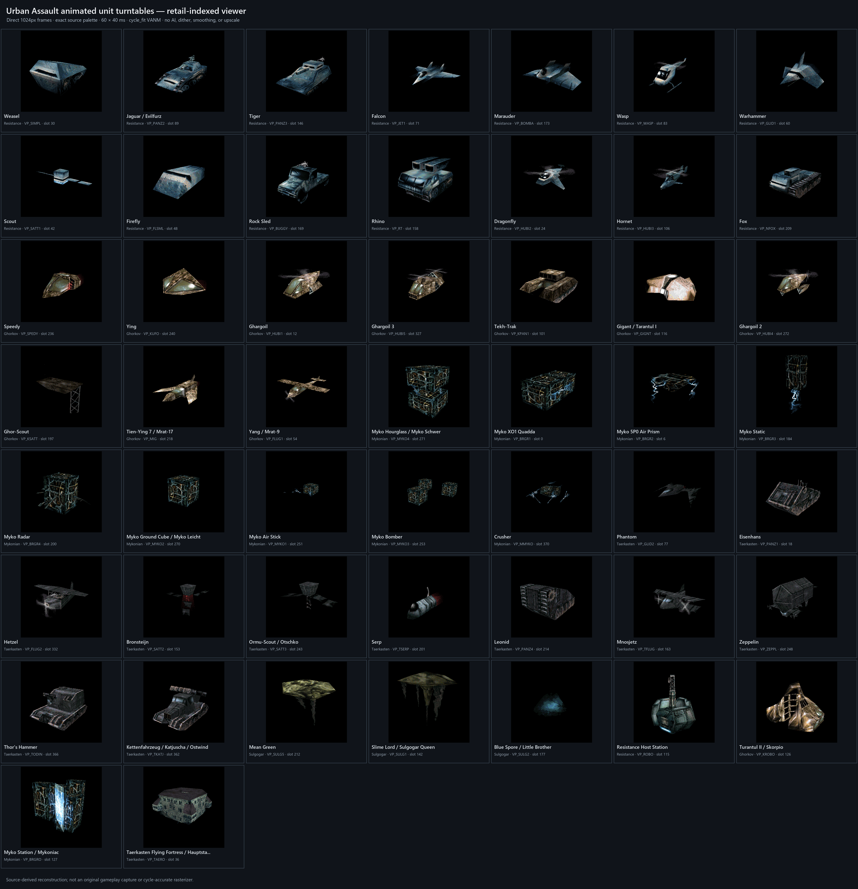

# Retail-indexed animated unit turntables

This is the bounded public reference subset produced for OpenUAStudio Retail
Indexed Viewer v4.0.0. It contains one animated 360-degree GIF for each of 47
deduplicated combat models selected from the five shipped faction scripts, plus
the four host/command models selected from `ROBOS.SCR`.

The contact sheet is the visual index. The tables below link to the full-size
GIFs individually so opening this page does not automatically transfer and
animate all 181 MiB of GIF data.

## Capture contract

- 51/51 assets passed; 47 combat models and four host/command models.
- 1024 x 1024 direct renders, 60 frames, 40 ms per frame, and a 2.4-second loop.
- Fixed camera except for a 6-degree yaw step; a hidden +360-degree frame had to
  match frame zero exactly.
- Retail-indexed reconstructed renderer with the live-framebuffer TRACY path.
- AREA distance fade disabled for close-reference presentation.
- One exact 256-entry display palette for every GIF; no local palettes,
  transparency, quantization, dithering, smoothing, image generation, or
  upscaling.
- Pillow and FFmpeg independently decoded all 3,060 GIF frames byte-identically
  to their lossless PNG masters. The PNG masters are intentionally not stored
  in Git.

Animation is deterministic **cycle-fit**, not native-speed gameplay capture.
Every authored image/UV order and frame-duration proportion is preserved, but
each active timeline is retimed to complete an integral number of cycles in the
short 2.4-second camera loop. This prevents an animation reset at the seam when
an asset's native timelines have incompatible or extremely long combined
periods. Per-source speed ratios in the complete audit corpus range from about
0.667x to 3.613x.

The Mykonian host `VP_BRGRO` uses the viewer's opt-in `source_atts_only`
submission policy. Its root polygon 36 is absent from every shipped AMESH ATTS
and AREA ADE mapping, so it is omitted exactly as the source renderer's
mapping-driven submission omits it. No material is invented. The other 50
assets remain under the default fail-closed policy with no omissions.

See [manifest.json](manifest.json) for capture provenance and aggregate
validation, and [SHA256SUMS.txt](SHA256SUMS.txt) for the exact hashes of every
published GIF and the contact index.

## Combat units

### Resistance

| Slot | Unit | Source BASE | GIF |
| ---: | --- | --- | --- |
| 30 | Weasel | `VP_SIMPL` | [open](gifs/combat_units/resistance/vp_030__weasel__VP_SIMPL.gif) |
| 89 | Jaguar / Evilfurz | `VP_PANZ2` | [open](gifs/combat_units/resistance/vp_089__jaguar_evilfurz__VP_PANZ2.gif) |
| 146 | Tiger | `VP_PANZ3` | [open](gifs/combat_units/resistance/vp_146__tiger__VP_PANZ3.gif) |
| 71 | Falcon | `VP_JET1` | [open](gifs/combat_units/resistance/vp_071__falcon__VP_JET1.gif) |
| 173 | Marauder | `VP_BOMBA` | [open](gifs/combat_units/resistance/vp_173__marauder__VP_BOMBA.gif) |
| 83 | Wasp | `VP_WASP` | [open](gifs/combat_units/resistance/vp_083__wasp__VP_WASP.gif) |
| 60 | Warhammer | `VP_GLID1` | [open](gifs/combat_units/resistance/vp_060__warhammer__VP_GLID1.gif) |
| 42 | Scout | `VP_SATT1` | [open](gifs/combat_units/resistance/vp_042__scout__VP_SATT1.gif) |
| 48 | Firefly | `VP_FLSML` | [open](gifs/combat_units/resistance/vp_048__firefly__VP_FLSML.gif) |
| 169 | Rock Sled | `VP_BUGGY` | [open](gifs/combat_units/resistance/vp_169__rock_sled__VP_BUGGY.gif) |
| 158 | Rhino | `VP_RT` | [open](gifs/combat_units/resistance/vp_158__rhino__VP_RT.gif) |
| 24 | Dragonfly | `VP_HUBI2` | [open](gifs/combat_units/resistance/vp_024__dragonfly__VP_HUBI2.gif) |
| 106 | Hornet | `VP_HUBI3` | [open](gifs/combat_units/resistance/vp_106__hornet__VP_HUBI3.gif) |
| 209 | Fox | `VP_NFOX` | [open](gifs/combat_units/resistance/vp_209__fox__VP_NFOX.gif) |

### Ghorkov

| Slot | Unit | Source BASE | GIF |
| ---: | --- | --- | --- |
| 236 | Speedy | `VP_SPEDY` | [open](gifs/combat_units/ghorkov/vp_236__speedy__VP_SPEDY.gif) |
| 240 | Ying | `VP_KUFO` | [open](gifs/combat_units/ghorkov/vp_240__ying__VP_KUFO.gif) |
| 12 | Ghargoil | `VP_HUBI1` | [open](gifs/combat_units/ghorkov/vp_012__ghargoil__VP_HUBI1.gif) |
| 327 | Ghargoil 3 | `VP_HUBI5` | [open](gifs/combat_units/ghorkov/vp_327__ghargoil_3__VP_HUBI5.gif) |
| 101 | Tekh-Trak | `VP_KPAN1` | [open](gifs/combat_units/ghorkov/vp_101__tekh-trak__VP_KPAN1.gif) |
| 116 | Gigant / Tarantul I | `VP_GIGNT` | [open](gifs/combat_units/ghorkov/vp_116__gigant_tarantul_i__VP_GIGNT.gif) |
| 272 | Ghargoil 2 | `VP_HUBI4` | [open](gifs/combat_units/ghorkov/vp_272__ghargoil_2__VP_HUBI4.gif) |
| 197 | Ghor-Scout | `VP_KSATT` | [open](gifs/combat_units/ghorkov/vp_197__ghor-scout__VP_KSATT.gif) |
| 218 | Tien-Ying 7 / Mrat-17 | `VP_MIG` | [open](gifs/combat_units/ghorkov/vp_218__tien-ying_7_mrat-17__VP_MIG.gif) |
| 54 | Yang / Mrat-9 | `VP_FLUG1` | [open](gifs/combat_units/ghorkov/vp_054__yang_mrat-9__VP_FLUG1.gif) |

### Mykonian

| Slot | Unit | Source BASE | GIF |
| ---: | --- | --- | --- |
| 271 | Myko Hourglass / Myko Schwer | `VP_MYKO4` | [open](gifs/combat_units/mykonian/vp_271__myko_hourglass_myko_schwer__VP_MYKO4.gif) |
| 0 | Myko XO1 Quadda | `VP_BRGR1` | [open](gifs/combat_units/mykonian/vp_000__myko_xo1_quadda__VP_BRGR1.gif) |
| 6 | Myko 5P0 Air Prism | `VP_BRGR2` | [open](gifs/combat_units/mykonian/vp_006__myko_5p0_air_prism__VP_BRGR2.gif) |
| 184 | Myko Static | `VP_BRGR3` | [open](gifs/combat_units/mykonian/vp_184__myko_static__VP_BRGR3.gif) |
| 200 | Myko Radar | `VP_BRGR4` | [open](gifs/combat_units/mykonian/vp_200__myko_radar__VP_BRGR4.gif) |
| 270 | Myko Ground Cube / Myko Leicht | `VP_MYKO2` | [open](gifs/combat_units/mykonian/vp_270__myko_ground_cube_myko_leicht__VP_MYKO2.gif) |
| 251 | Myko Air Stick | `VP_MYKO1` | [open](gifs/combat_units/mykonian/vp_251__myko_air_stick__VP_MYKO1.gif) |
| 253 | Myko Bomber | `VP_MYKO3` | [open](gifs/combat_units/mykonian/vp_253__myko_bomber__VP_MYKO3.gif) |
| 370 | Crusher | `VP_MMYKO` | [open](gifs/combat_units/mykonian/vp_370__crusher__VP_MMYKO.gif) |

### Taerkasten

| Slot | Unit | Source BASE | GIF |
| ---: | --- | --- | --- |
| 77 | Phantom | `VP_GLID2` | [open](gifs/combat_units/taerkasten/vp_077__phantom__VP_GLID2.gif) |
| 18 | Eisenhans | `VP_PANZ1` | [open](gifs/combat_units/taerkasten/vp_018__eisenhans__VP_PANZ1.gif) |
| 332 | Hetzel | `VP_FLUG2` | [open](gifs/combat_units/taerkasten/vp_332__hetzel__VP_FLUG2.gif) |
| 153 | Bronsteijn | `VP_SATT2` | [open](gifs/combat_units/taerkasten/vp_153__bronsteijn__VP_SATT2.gif) |
| 243 | Ormu-Scout / Otschko | `VP_SATT3` | [open](gifs/combat_units/taerkasten/vp_243__ormu-scout_otschko__VP_SATT3.gif) |
| 201 | Serp | `VP_TSERP` | [open](gifs/combat_units/taerkasten/vp_201__serp__VP_TSERP.gif) |
| 214 | Leonid | `VP_PANZ4` | [open](gifs/combat_units/taerkasten/vp_214__leonid__VP_PANZ4.gif) |
| 163 | Mnosjetz | `VP_TFLUG` | [open](gifs/combat_units/taerkasten/vp_163__mnosjetz__VP_TFLUG.gif) |
| 248 | Zeppelin | `VP_ZEPPL` | [open](gifs/combat_units/taerkasten/vp_248__zeppelin__VP_ZEPPL.gif) |
| 366 | Thor's Hammer | `VP_TODIN` | [open](gifs/combat_units/taerkasten/vp_366__thor_s_hammer__VP_TODIN.gif) |
| 362 | Kettenfahrzeug / Katjuscha / Ostwind | `VP_TKATJ` | [open](gifs/combat_units/taerkasten/vp_362__kettenfahrzeug_katjuscha_ostwind__VP_TKATJ.gif) |

### Sulgogar

| Slot | Unit | Source BASE | GIF |
| ---: | --- | --- | --- |
| 212 | Mean Green | `VP_SULG5` | [open](gifs/combat_units/sulgogar/vp_212__mean_green__VP_SULG5.gif) |
| 142 | Slime Lord / Sulgogar Queen | `VP_SULG1` | [open](gifs/combat_units/sulgogar/vp_142__slime_lord_sulgogar_queen__VP_SULG1.gif) |
| 177 | Blue Spore / Little Brother | `VP_SULG2` | [open](gifs/combat_units/sulgogar/vp_177__blue_spore_little_brother__VP_SULG2.gif) |

## Host/command units

| Faction | Slot | Unit | Source BASE | GIF |
| --- | ---: | --- | --- | --- |
| Resistance | 115 | Resistance Host Station | `VP_ROBO` | [open](gifs/host_command_units/resistance/vp_115__resistance_host_station__VP_ROBO.gif) |
| Ghorkov | 126 | Turantul II / Skorpio | `VP_KROBO` | [open](gifs/host_command_units/ghorkov/vp_126__turantul_ii_skorpio__VP_KROBO.gif) |
| Mykonian | 127 | Myko Station / Mykoniac | `VP_BRGRO` | [open](gifs/host_command_units/mykonian/vp_127__myko_station_mykoniac__VP_BRGRO.gif) |
| Taerkasten | 36 | Taerkasten Flying Fortress / Hauptstation | `VP_TAERO` | [open](gifs/host_command_units/taerkasten/vp_036__taerkasten_flying_fortress_hauptstation__VP_TAERO.gif) |

## Scope and rights

These are source-traced reconstruction renders, not original 1998 gameplay
captures and not a claim of cycle-accurate retail rasterization. Buildings,
projectiles, effects, tutorial objects, and firing/dead/wreck/wait/genesis
variants are outside this bounded unit corpus.

No game archive, palette, remap table, mesh, texture, animation, executable, or
other proprietary source asset is included here. The rendered appearances are
derived from a lawfully obtained local copy of the game and are included for
technical documentation and visual reference. Rights in Urban Assault and its
original art remain with their respective owners; these captures are not
relicensed as GPL source code.
